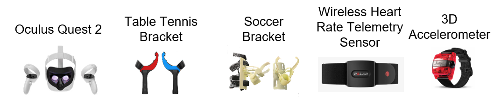

<h1 style="text-align: center; font-size: 4em;">
  🏓⚽️🏃‍♂️REVERIE
</h1>
REVERIE is a deep reinforcement learning-ensembled VR system to provide personalized sports interventions for adolescents with excess body weight.

# Hardware
### Equipment list
* Oculus Quest 2 (Oculus Quest 2, Meta, USA)
* Table tennis bracket 
* 3D printed soccer bracket
* Heart rate monitor (Polar Verity Sense, Polar Electro Oy, Kempele, Finland)
* 3D accelerometer (Actigraph wGT3x-BT, Actigraph, Pensacola, USA)
<div style="text-align: center;">

</div>

### REVERIE Table tennis

(a) Insert the Oculus Quest 2 Touch Controller into the table tennis bracket.


(b) Wear the hardware devices.
<div style="text-align: center;">

</div>

### REVERIE Soccer

(a) Insert the Oculus Quest 2 Touch Controller into the 3D printed soccer bracket.


(b) Wear the hardware devices.
<div style="text-align: center;">

</div>

### 3D printed parts

3D models

* <a href="hardware/3Dmodels/left_lef.fbx" target="_blank">left_leg.fbx</a>
* <a href="hardware/3Dmodels/right_leg.fbx" target="_blank">right_leg.fbx</a>


# Software

## Setup
This software is developed and packaged using Unity3D (2020.3.28) compatible with a Windows10 system. The deep learning related methods are developed using Python 3.9 and Pytorch 1.11 and are trained on Ubuntu 20.04 with NVIDIA GeForce RTX 3090. It necessitates 256GB of RAM and 20 TB of disk storage.

## Install
1. Clone this repositoty and navigate to REVERIE folder.
```bash
git clone https://anonymous.4open.science/r/REVERIE-Sports-474C.git
cd REVERIE
```
2. Install Package.
```bash
conda create -n REVERIE python=3.9 -y
conda activate REVERIE
conda install pytorch==1.11.0 torchvision==0.12.0 torchaudio==0.11.0 cudatoolkit=10.2 -c pytorch
pip install --upgrade pip 
pip install -e .
```


## REVERIE-Environment
### Setup
Please download the Unity3D (2020.3.28 or higher version) from [Unity](https://unity.com/download).
### Install
1. Please donwload the [`Table tennis.rar`](https://drive.google.com/file/d/11AxyHYg9BsmSIzXD497iq5mOpfwRit-8/view?usp=sharing) which is too large to upload to Github. 
2. Please unzip the `Table tennis.rar`.
3. Navigate to `Table tennis` or `Soccer` foler.
4. The `REVERIE Soccer` is in folder `REVERIE-Environment/Soccer`
4. Open and operate these softwares using `Unity3D`.

### Build APK
##### Setup
* Oculus Quest2 is connected to the PC
* Oculus Quest2 is in developer mode
* [adb](https://developer.android.com/tools/adb) is installed

#### Build
1. Please install `XR Plug-in` in `Edit --> Project Settings --> XR Plugin Management`
2. Please set the build platform to `Android` in `Build Settings`.
3. Please enable `XR Plug-in`
4. Please select connected Oculus Quest 2 in the `Android` of `Build Settings`
5. Please click `Build & Run`


## REVERIE-Rendering
### Install
1. Navigate to REVERIE-Rendering folder.
```bash
cd REVERIE-Rendering
```
2. Activate virtual environment.
```bash
conda activate REVERIE
```
### Pre-trained model weights 
Please follow the [official document](https://mmdetection.readthedocs.io/en/latest/get_started.html) to install mmdetection. 
Then, please download the pre-trained model weights [here](https://download.openmmlab.com/mmdetection/v3.0/rtmdet/rtmdet_tiny_8xb32-300e_coco/rtmdet_tiny_8xb32-300e_coco_20220902_112414-78e30dcc.pth).
You can test the RTMDet-Ins:
```Shell
cd mmdectection
```
```bash
python tools/test.py configs/rtmdet/rtmdet-ins_tiny_8xb32-300e_coco.py rtmdet_tiny_8xb32-300e_coco_20220902_112414-78e30dcc.pth --out test-results 
```

### Pre-pare sports-related dataset. 
1. Data collection. Please collect the image and related annotations in Unity3D following the descriptions in our paper.
```
|----sports-related dataset
     |----annotation
        |----instances_test.json
        |----instances_train.json
        |----instances_val.json
     |----images
        |----test
        |----train
        |----val
```
2. Convert the dataset to COCO format. In order to facilitate training, convert sports-related dataset into the COCO format. Please revise the `CLASSES` in `mmdet/datasets/coco.py` as 
```
METAINFO = {
        'classes':
        ('racket', 'table', 'table tennis ball', 'table tennis coach', 'goal', 'foot', 'soccer ball', 'soccer caoch'),
        # palette is a list of color tuples, which is used for visualization.
        'palette':
        [(220, 20, 60), (119, 11, 32), (0, 0, 142), (0, 0, 230), (106, 0, 228),
         (0, 60, 100), (0, 80, 100), (0, 0, 70)]
    }
```
Then, rebuild the whole project to update the classname:
```shell
python setpup.py install build
```

3. Generate configuration file. Use the training script to generate the `rtmdet-ins_tiny.py`, please remember to change the `num_classes`, `data_root`, `ann_file` and `data_prefix`.
```shell
python tools/train.py configs/rtmdet/rtmdet-ins_tiny_8xb32-300e_coco.py --work_dir our_config
```

4. Fine-tune. Finally, fine-tune the model on sports-related dataset:
```shell
python tools/train.py our_config/rtmdet-ins_tiny.py --word_dir our_model
```

5. Inference. Test the results using fine-tuned model:
```shell
python tools/test.py configs/rtmdet/rtmdet-ins_tiny.py best_checkpoint.pth --out our_test-results 
```

6. Sports-related rendering. Based on the original frame and predicted sports-related regions, obtain the final frame:
```
python main.py
```
You can test the method using `img` and `mask` in `test` folder.

## REVERIE-Agent
### Install
1. Navigate to REVERIE-Agent folder.
```bash
cd REVERIE-Agent
```
2. Activate virtual environment.
```bash
conda activate REVERIE
```
### Build training environment
1. Install [Unity ML-Agents Toolkit](https://unity-technologies.github.io/ml-agents/) following this [page](https://unity-technologies.github.io/ml-agents/Installation/).
2. Click the environment in REVERIE-Environment Module and set:
```bash
File --> Build Settings
```
3. Click the Server Build:
```bash
Server Build
```
4. Click Player Settings:
```bash
Player Settings
```
5. Choose Run In BackGround:
```bash
Player --> Run In Background
```
6. Click Build.
7. Save the environment under `envs` folder.
### Run
1. The code is based on a publicly available github repository [LOGO](https://github.com/DesikRengarajan/LOGO) and [PyTorch-RL](https://github.com/Khrylx/PyTorch-RL).
2. Copy the path of the environment `envs/XXXX.exe` into `env_path` in `run_RC.py`.
3. Train the REVERIE Coach for mastering different sports guidance instructions using the following script:
```bash
python python run_RC.py
```

# Motion capture
1. Participants wore black tight-fitting suits, and 40 infrared reflective markers (diameter: 14mm).
```bash
bilateral acromion, perimeter of the head, bilateral humeral condyles (medial and lateral), bilateral ulnar condyles, bilateral radial condyles,  bilateral third metacarpophalangeal joint capsules, manubrium of the sternum, body of the sternum, first vertebra, inferior border of bilateral scapulae, tenth vertebra, bilateral iliac crests (left and right), bilateral anterior superior iliac spines (left and right), bilateral greater trochanters of the femur (left and right), bilateral distal femur (medial and lateral condyles), bilateral proximal tibia (medial and lateral condyles), bilateral malleoli (medial and lateral), and the distal ends of the first and fifth metatarsal bones (left and right)
```
2. They also wore the REVERIE Hardware.
3. All motions were performed under the guidance of the REVERIE system and were collected through Avatar Pro (Avatar Pro 2.0, Chingmu, China).

<div style="text-align: center;">

</div>

<div style="text-align: center;">

</div>

# Demo of REVERIE sports
Here is the demo video of the REVERIE system.

<div style="display: flex; justify-content: space-between; width: 100%;">
  
  
</div>
